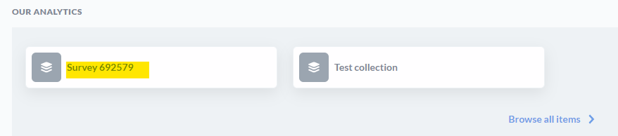
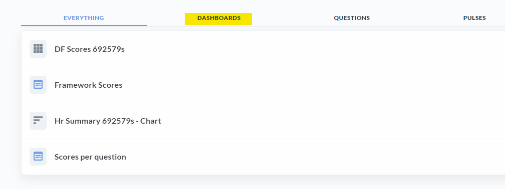
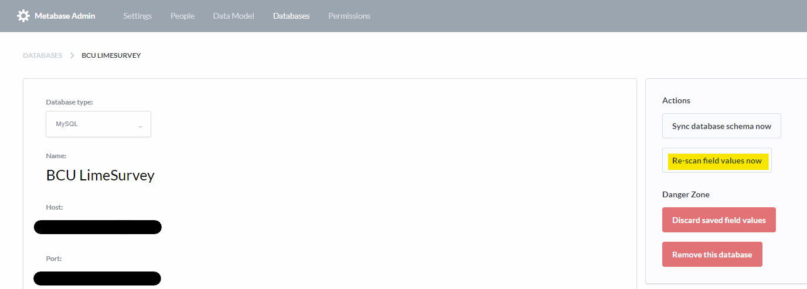

## Dashboards

Two dashboards have been created to date:

- Framework scores - chart shown to users on completion of the survey
- Scores per question - Displays the scores, out of 3 per question

### Accessing dashboards

- Login
- Click 'Survey 692579' in 'Our Analytics'

- Select 'Dashboards'

- Select a dashboard to view

## Syncing

### Scanning for field values

When Metabase first connects to your database, it takes a look at the metadata of the fields in your tables and automatically assigns them a field type. Metabase also takes a sample of each table to look for URLs, JSON, encoded strings, etc. If a field is classified wrong, you can always manually edit it from the Metadata tab in the Admin Panel.

By default, Metabase also performs a more intensive daily sampling of each field’s values and caches the distinct values in order to make checkbox and select filters work in dashboards and SQL/native questions.

Source: [Metabase documentation](https://metabase.com/docs/latest/administration-guide/01-managing-databases.html)

### Manually scanning for field values

Select Admin > Databases > 'Re-scan field values now'

Note: Please contact us before making any changes in the 'Database' form this will lose the connection to the DB and break the charts.
